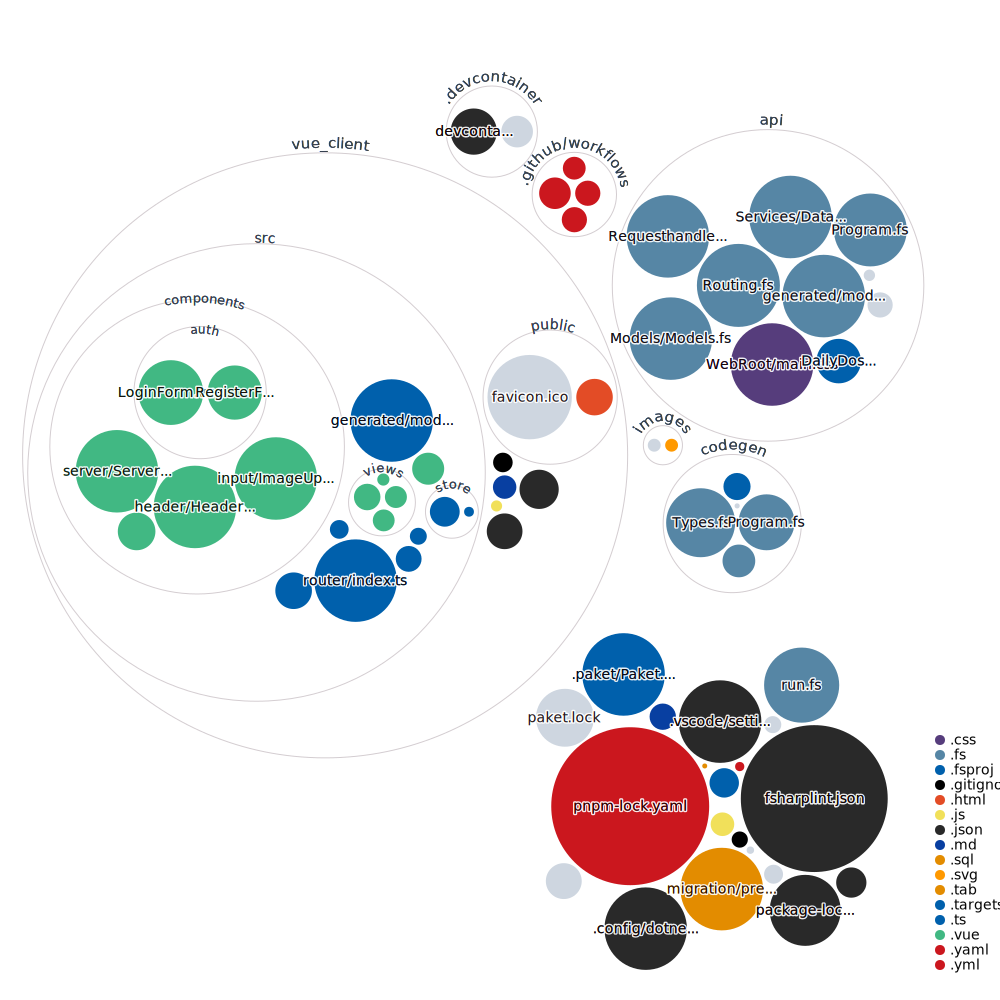

# daily_dos

[](https://github.com/Paggimm/daily_dos/commits/)



## Commands

To use the code generator for shared models:
```bash
dotnet run generate
```

To run the client (Port 8080):
```bash
dotnet run client
```

To run the server (Port 8085):
```bash
dotnet run server
```
